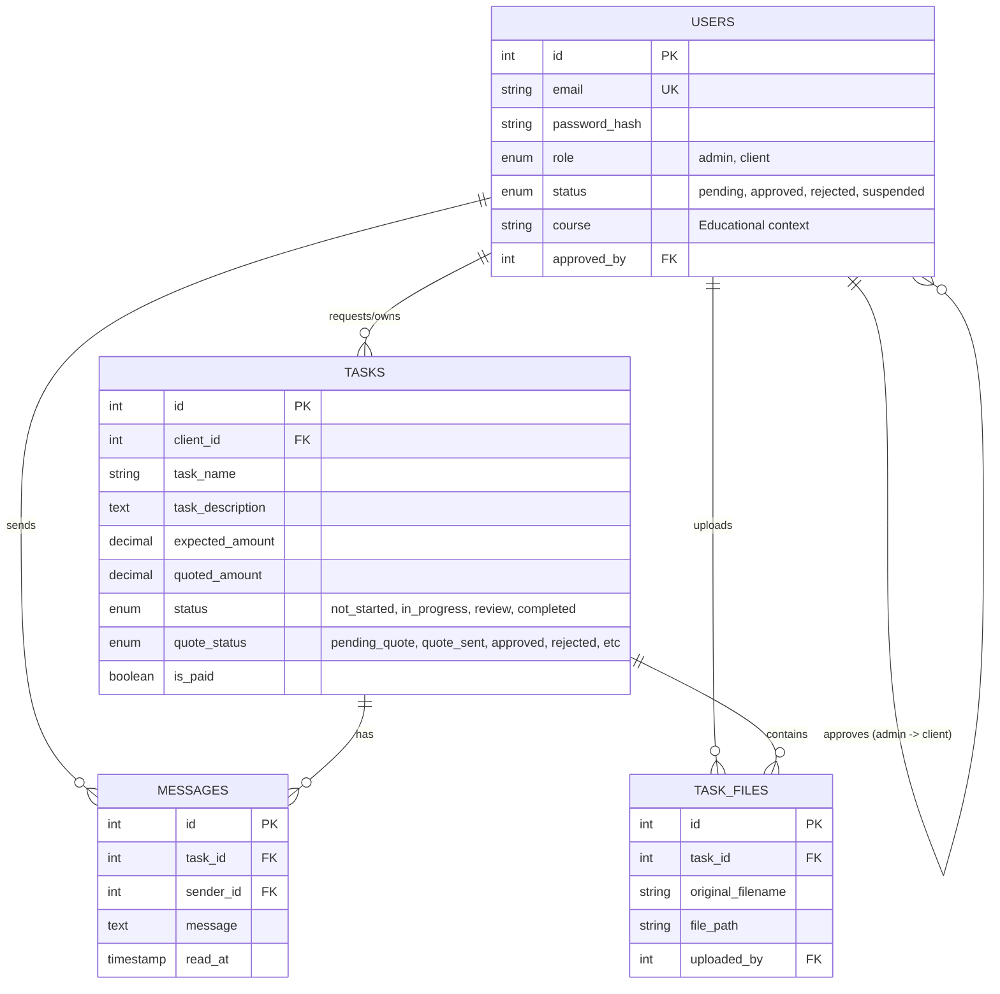

# Database Analysis & System Purpose: K-Track

## 1. Database Schema Overview

The K-Track system uses a relational MySQL database (`ktrack`) with four core tables designed to facilitate a managed service workflow.

### Entity Relationship Mapping

---

## 2. Deep Dive Into Purposed Logic

### A. The Managed Onboarding Flow
Unlike open SaaS platforms, K-Track implements a **gatekeeping mechanism**:
- Users register with a `pending` status.
- Admins must manually `approve` users (stored in `approved_at` and `approved_by`).
- This suggests a high-touch service where the identity or eligibility of the client (e.g., being in a specific `course`) is verified.

### B. The Financial Negotiation Loop
The system isn't just for tracking work; it's for **selling services**:
- **Task Initiation**: Client describes a task.
- **Quoting**: Admin reviews and sets a `quoted_amount`.
- **Negotiation**: The `quote_status` transitions from `pending_quote` -> `quote_sent` -> `approved` or `rejected`.
- **Payment Verification**: `is_paid` is a manual toggle, likely confirmed by the admin after receiving payment outside the platform or via a separate gateway.

### C. Collaboration Environment
- **Contextual Chat**: Messages are tied to `task_id`, ensuring all discussions about a project stay within its context.
- **Evidence/Deliverables**: `task_files` allows for sharing requirements (client -> admin) and finished work (admin -> client).

---

## 3. System Evolution (Migration History)

The database shows a clear progression from a basic tracker to a complex management tool:

1.  **Phase 1: Workflow Foundation**: Added structured metadata to tasks (`priority`, `status`, `notes`) to move beyond simple "todo" items.
2.  **Phase 2: Security & Roles**: Introduced the `users` table, transitioning the system to a multi-tenant, role-based application.
3.  **Phase 3: File Support & Ownership**: Integrated file management and strictly linked tasks to specific user IDs (`client_id`).
4.  **Phase 4: Communication Layer**: Built the `messages` system to consolidate project discussions.
5.  **Phase 5: User Engagement**: Added `notifications` to alert users of task updates or new messages.
6.  **Phase 6: UI Refinement**: Added `task_name` to improve the clarity of task lists in the dashboards.

---

## 4. Final Conclusion: The Purpose of the System

**K-Track** is a **Boutique Service Management Portal**, likely tailored for **academic tutoring or freelance technical services**.

Its primary purpose is to provide a secure, professional bridge between a service provider (Admin) and their clients. It automates the "business" side of freelancing—onboarding, quoting, project tracking, and file delivery—while maintaining a high-quality standard through manual admin approvals.

**Key Use Case**: A student or client needs a specific project done (related to their `course`). They submit a request, negotiate the price with the expert, communicate through the portal to refine the work, and receive their final files once payment is confirmed.
